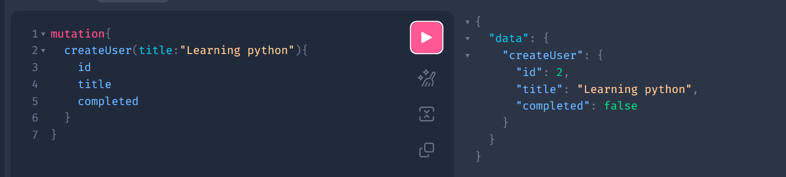
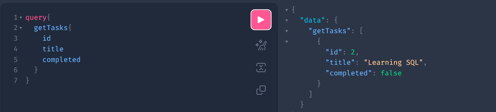
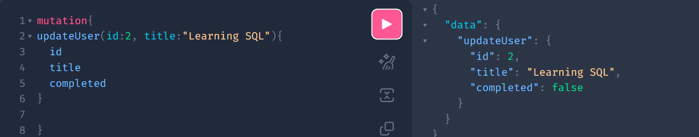
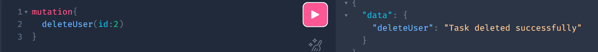

# Task Management API (FastAPI + GraphQL + SQLAlchemy + PostgreSQL)

## Overview
This project is a Task Management API built using FastAPI, GraphQL (Strawberry), SQLAlchemy ORM, and PostgreSQL. It demonstrates full CRUD operations (Create, Read, Update, Delete) using GraphQL resolvers.

## Technologies Used
- FastAPI
- Strawberry GraphQL
- SQLAlchemy ORM
- PostgreSQL
- Uvicorn

## Features
- Create Task
- Get All Tasks
- Update Task
- Delete Task
- GraphQL API integration

## How to Run the Project

1. Install dependencies:
pip install fastapi uvicorn sqlalchemy psycopg2-binary strawberry-graphql python-dotenv

2. Create PostgreSQL database:
CREATE DATABASE crud_task_db;

1. Run the server:
uvicorn main:app --reload

1. Open GraphQL Playground:
http://127.0.0.1:8000/graphql

## Screenshots

### Create Task

### Get All Tasks

### Update Task

### Delete Task

