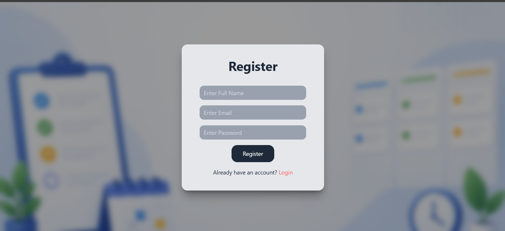
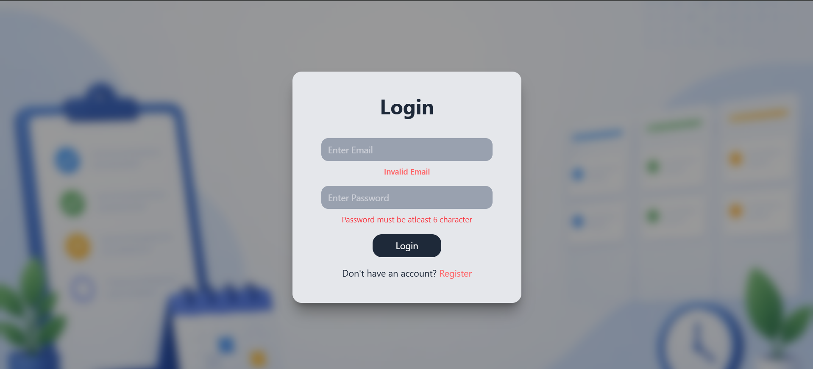
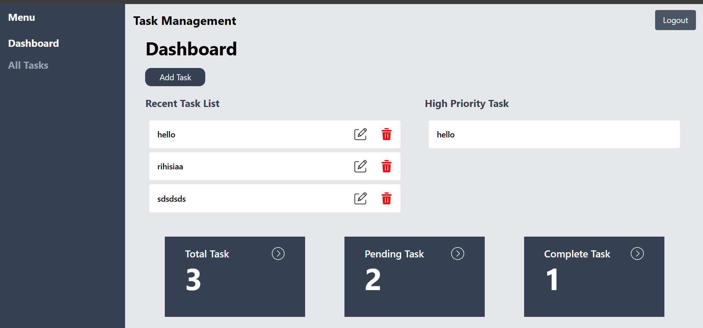
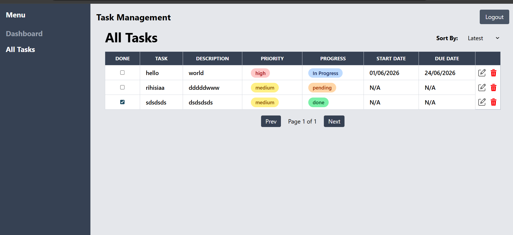
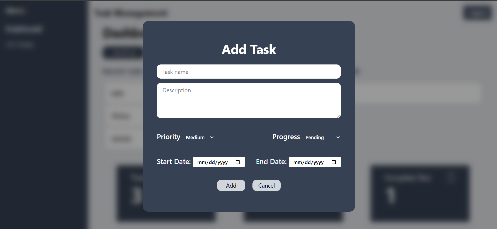
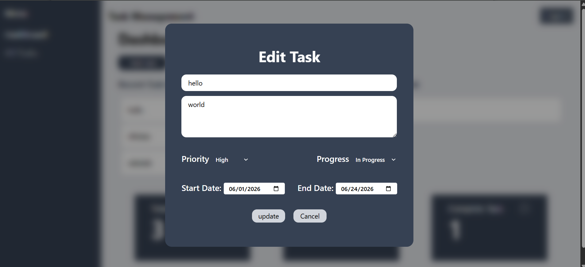
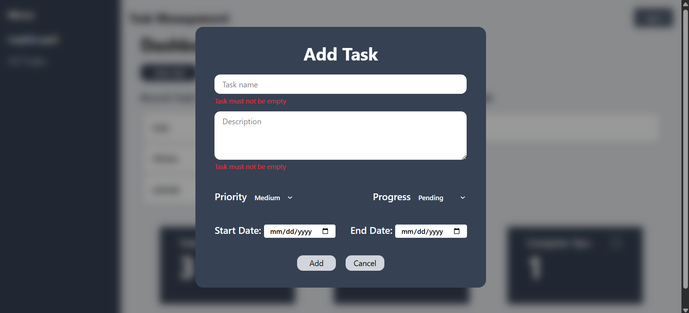
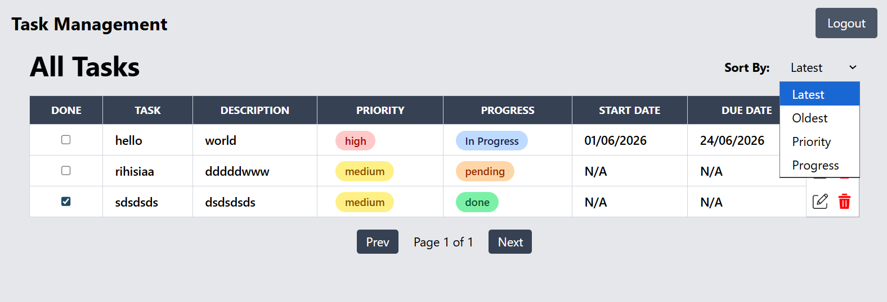

# Task Management App (React)

A simple Task Management web application built using React.  
It allows users to add, edit, delete, and manage tasks with priority, progress status, and due dates.

## Live Demo

🔗 https://task-management-ssystem.netlify.app/

## Features

- Add new tasks
- Edit existing tasks
- Delete tasks
- Mark tasks as completed
- Filter tasks
- Set priority (High / Medium / Low)
- Track progress (Pending / In Progress / Done)
- Add start date and end date
- Dashboard view with task summary

## Tech Stack

- React.js
- Context API (State Management)
- Tailwind CSS
- JavaScript (ES6+)

## Installation

1. Clone the repository
   git clone https://github.com/your-username/task-manager.git

2. Install dependencies
   npm install

3. Run the project
   npm run dev

## Screenshots

### Login

### Register

### Login Validation

### Dashboard

### Task Page

### Add Task

### Edit Task

### Add Task Validation

### Sorting

